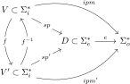

# 拼写运算

改写自[Spelling Algebra](https://github.com/rime/home/wiki/SpellingAlgebra)

<!-- Spelling Algebra is nothing mysterious, this is a crash explanation may be benificial for comparison -->

拼写运算并不神秘，此处用数学语言复述一遍，省略部分细节，供大家对照。

|    概念    |                           记号                           |                注释                |
| :--------: | :------------------------------------------------------: | :--------------------------------: |
| 输入字符集 |                        $\Sigma_i$                        |                                    |
| 编码字符集 |                        $\Sigma_e$                        |                                    |
| 输出字符集 |                        $\Sigma_o$                        |                                    |
| 输入字符串 |                   $s_i \in \Sigma_i^*$                   |              e.g.`xt`              |
| 编码字符串 |                   $s_e \in \Sigma_e^*$                   |             e.g. `xue`             |
| 输出字符串 |                   $s_o \in \Sigma_o^*$                   |             e.g. `学`              |
|   输入法   |         $ipm:\Sigma_i^* \rightarrow \Sigma_o^*$          |          e.g. 自然码双拼           |
|    编码    |     $e: D \subset \Sigma_e^* \rightarrow \Sigma_o^*$     |            $D$ 称为码表            |
|   拼写法   |    $sp: V \subset \Sigma_i^* \rightarrow \Sigma_e^*$     | $V$ 称为有效拼写集，其元素称为拼写 |
|  拼写算式  | $r: R \subset \Sigma_i^* \rightarrow V' \sub \Sigma_i^*$ |           $R \subset V$            |
|  拼写变换  | $f: V \subset \Sigma_i^* \rightarrow V' \sub \Sigma_i^*$ |    $f$ 由一组拼写算式生成，见下    |

注：原文用拼写运算指 f 限制在一个元素/一个正则子集上的情形，而称 f 为投影。能指与所指都不自然。此处拼写运算指一整套内容。

总结一下

[](https://tikzcd.yichuanshen.de/#N4Igdg9gJgpgziAXAbVABwnAlgFyxMJZABgBpiBdUkANwEMAbAVxiRADUACAHW7iYBGcGDh7cAylgDmAWzoB9LAD0AVJxABfUuky58hFAEZShqrUYs2AETH8hIsZNkKYq9Vp3Y8BImQBMZvTMrIgcAOS2gsKivE5yim6a2iAYXvpEfiaBFiEgsdLxEKqaZjBQUvBEoABmAE4QMkhkIDgQSMYgDHQCMAwACrreBiBYYNiwINRBlqFwaEk19Y2Iza1ImSA9YFBIALQAzM1dPf2D6aGj46xTOWzVCyB1DevUa4gdx70DaT4XY1gTG7BNhzMIPJ7LDZvZpbHaIA5HbpfM6-Eb-QHmYGhapKYC7QwaSYgOAACyw1RwTWoDFGuTgEBpO2oJJgdDhYCYDAYrzoWAYbEgYFYHkeS3arzaiH21KRpx+wwYMApROmuWuxLJypW1FhTRFEKpLUl0s2MG2SEOQJmIzQjX1YsQUONOrNcIRMpO3z0qNq0hJlKtuSwtrBGgoGiAA)

注意此处的映射除 $e$ 外均可能是一对多的，应将这些映射视为字典。

最后是**投影**的概念。具体来说，投影基于一个拼写变换$f$，即

$\alpha_f: sp \mapsto sp'=sp \circ f^{-1}$，

同时诱导出新输入法

$\tilde{\alpha}_f: ipm = e \circ sp \mapsto ipm' = e \circ sp'$。

## 拼写算式：

句法：`<op><sep><s_ptn><sep><t_ptn>`

其中`<sep>`为`/`，若表达式内无空格，则可用空格代替

除转写外，`<s_ptn> <t_ptn>`均为正则表达式。

以下用$sp$表示原有效拼写集，$V'$表示新有效拼写集，$s$表示符合`<source pattern>`的字符串，$t$表示符合`<target pattern>`的字符串。

|     算子      |         效果         |                       作用在字符串上举例                        | 应用 |
| :-----------: | :------------------: | :-------------------------------------------------------------: | :--: |
|  转写 `xlit`  |       对位替换       |    `xlit/abc/ABC/` abcdbca $\in V \mapsto$ ABCdBCA $\in V'$     |      |
| 变形 `xform`  |     匹配部分替换     |    `xform/^([nl])ue$/$1ve/` nue $\in V \mapsto$ nve $\in V'$    |      |
| 消除 `erase`  |     匹配全部清除     |      `erase/^.*\d$/` dang1 $\in V \mapsto \epsilon \in V'$      |      |
| 派生 `derive` |       匹配加入       | `derive/^([nl])ue$/$1ve/` lue $\in V \mapsto$ lue, lve $\in V'$ |      |
|  模糊 `fuzz`  | 派生后添加*模糊*属性 |                     同上，用于词组而非单字                      |      |
| 缩略 `abbrev` | 派生后添加*缩略*属性 |                      同上，用于音节切分时                       |      |

## 拼写变换的生成

按顺序给定一组拼写算式$r_1,r_2,\cdots,r_n$，其生成的拼写变换$f$表示为：$f = r_n \circ r_{n-1} \cdots \circ r_1$

故投影 $\alpha_f: sp \mapsto sp' = sp \circ r_1^{-1} \circ r_2^{-1} \circ \cdots \circ r_n^{-1}$

即按**顺序**将算式作用在原码表上直到结束。
